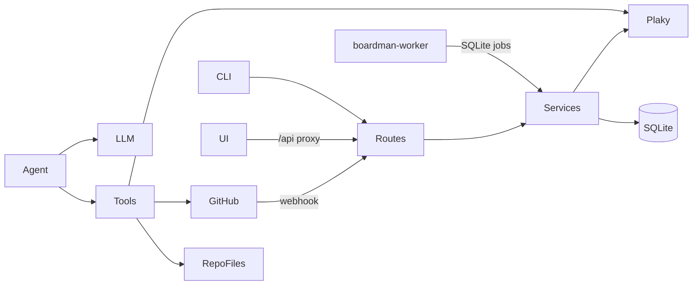

# deepiri-boardman — agent context

> Machine-oriented project brief. Humans: see [README.md](README.md) and [docs/](docs/).
> Last verified: 2026-06-05 (PLAN, AGENT_PLAN, NEW_FEATURES, SETUP, DIRECTION reconciled)

## Purpose

GitHub ↔ Plaky sync automation with an AI layer: webhook-driven task/comment/status sync, `DIRECTION.md`-driven repo scan, and a LangChain tool-calling agent for Plaky/GitHub/repo operations. Surfaces: FastAPI (`:8090`), Typer CLI (`boardman`), React UI (`boardman-ui`, `:5176` dev / `:8088` prod via nginx), SQLite persistence.

## Doc routing (read order)

1. [docs/PLAN.md](docs/PLAN.md) — single source of truth (architecture, phases, agent contract)
2. [README.md](README.md) + [SETUP.md](SETUP.md) — run, deploy, credentials
3. Domain doc from index below for your task
4. [docs/AGENTS_MAINTENANCE.md](docs/AGENTS_MAINTENANCE.md) — when to update AGENTS.md, PLAN.md, and related docs

## Documentation index

| Doc | Use when |
|-----|----------|
| [docs/PLAN.md](docs/PLAN.md) | Architecture, what's built vs planned, board routing, agent behavior, phases A–J |
| [README.md](README.md) | Quick start, CLI/API list, Docker stacks, tests |
| [SETUP.md](SETUP.md) | Plaky/GitHub credentials, webhook registration, Poetry install |
| [docs/DEPLOYMENT.md](docs/DEPLOYMENT.md) | Production VPS deploy, secrets, worker, smoke tests, branch/PR rules |
| [docs/BOARDMAN_READINESS.md](docs/BOARDMAN_READINESS.md) | `boardman readiness`, Plaky inventory, go-live gates |
| [docs/BOARDMAN_SUPPORT_SESSION.md](docs/BOARDMAN_SUPPORT_SESSION.md) | Support-session checklist, pass/fail signals |
| [docs/AGENT_PLAN.md](docs/AGENT_PLAN.md) | Agent module layout, tools, memory (supplement to PLAN.md) |
| [docs/AGENTS_MAINTENANCE.md](docs/AGENTS_MAINTENANCE.md) | **Required** — when agents must update docs after code changes |
| [docs/NEW_FEATURES_PLAN.md](docs/NEW_FEATURES_PLAN.md) | Feature backlog with Done/Partial/Planned status per item |
| [docs/ADDITIONAL_FEATURES.md](docs/ADDITIONAL_FEATURES.md) | **Future** ideas: alternate kanban providers, local bidirectional UI |
| [docs/TAKEHOME_STATUS.md](docs/TAKEHOME_STATUS.md) | QA tier classification problem space, thresholds, maintainer context |
| [docs/DIRECTION_TEMPLATE.md](docs/DIRECTION_TEMPLATE.md) | Template for bootstrapping `DIRECTION.md` in target repos |
| [DIRECTION.md](DIRECTION.md) | This repo's direction file (scan/agent input) |
| [boardman-ui/README.md](boardman-ui/README.md) | UI dev server, proxy, production nginx path |
| [.github/codeql/README.md](.github/codeql/README.md) | CodeQL config notes |
| [tests/fixtures/github/README.md](tests/fixtures/github/README.md) | GitHub webhook fixture descriptions |

## Config files (non-markdown)

| File | Purpose |
|------|---------|
| [repos.yml](repos.yml) | Repo → Plaky table/category routing |
| [team_assignments.yml](team_assignments.yml) | QA/engineer Plaky field assignments |
| [.env.example](.env.example) | Local/dev env template |
| [.env.production.example](.env.production.example) | Production env template |
| [pyproject.toml](pyproject.toml) + `poetry.lock` | Poetry deps; CLI entry `boardman` |
| [docker-compose.yml](docker-compose.yml) | Dev stack (+ optional Ollama) |
| [docker-compose.prod.yml](docker-compose.prod.yml) | Production cloud stack (no Ollama) |
| [alembic/versions/](alembic/versions/) | DB migrations (001 initial → 004 webhook dedupe) |

## Repo map

```
deepiri-boardman/
├── boardman/
│   ├── main.py                  # FastAPI app
│   ├── settings.py              # pydantic-settings (all env vars)
│   ├── cli/commands.py          # Typer CLI
│   ├── routes/                  # agent, tasks, github_events, plaky, repos, assignment, health
│   ├── services/                # issue/pr/scan handlers, PR linking, task mutations
│   ├── plaky/                   # HTTP client, board schema, placement, inventory
│   ├── github/                  # org repos, webhooks, QA roster, tier teams
│   ├── agent/                   # LangChain runner, prompts, guardrails, memory
│   │   └── tools/               # plaky_tools, repo_tools, github_tools, assignment_tools
│   ├── llm/                     # factory, completion, ollama_autodetect
│   ├── assignment/              # QA picker, tier classifier, identity match
│   ├── database/                # SQLAlchemy models + session
│   ├── broker/, jobs/           # SQLite background job queue
│   ├── cache/                   # Optional Redis agent cache
│   ├── ratelimit/               # Leaky-bucket for agent endpoints
│   └── sqlite_worker.py         # boardman-worker process
├── boardman-ui/                 # Vite + React agent chat
├── alembic/                     # DB migrations
├── tests/                       # pytest (unit + live markers)
├── scripts/                     # deploy_preflight, deploy_smoke, benchmarks
├── worker/                      # Optional Cloudflare Worker (QA assignment proxy)
├── deploy/nginx/                # Production reverse proxy
└── docs/
```

## Run / test / deploy

```bash
poetry install --with dev
poetry run alembic upgrade head
poetry run python -m boardman.main          # API :8090
poetry run boardman <cmd>                   # CLI
poetry run pytest tests/                    # tests
cd boardman-ui && npm install && npm run dev  # UI :5176

# Docker dev (includes Ollama sidecar)
./scripts/deploy_preflight.sh
docker compose up -d --build

# Docker prod (no Ollama)
BOARDMAN_COMPOSE_FILE=docker-compose.prod.yml bash scripts/deploy_preflight.sh
docker compose -f docker-compose.prod.yml up -d --build
BOARDMAN_COMPOSE_FILE=docker-compose.prod.yml bash scripts/deploy_smoke.sh

poetry run boardman readiness
poetry run boardman doctor
```

## Architecture



**Services (Docker):** `boardman` (API :8090), `boardman-worker` (SQLite job loop), `boardman-nginx` (UI + `/api` proxy :8088). Dev compose adds `ollama`. Optional `redis` behind `agent-cache` profile.

## API surface

| Method | Path | Notes |
|--------|------|-------|
| GET | `/api/v1/health` | Health check |
| GET | `/api/v1/mappings` | Issue↔task mappings |
| GET | `/api/v1/sync-logs` | Sync audit log |
| POST | `/api/v1/webhooks/github` | GitHub webhook receiver |
| POST | `/api/v1/tasks` | Create Plaky task |
| GET | `/api/v1/tasks` | List tasks |
| GET/PATCH | `/api/v1/tasks/{id}` | Get/update task |
| POST | `/api/v1/tasks/{id}/subtasks` | Create subtask |
| POST | `/api/v1/tasks/{id}/link-pr` | Link PR to task |
| POST | `/api/v1/agent/chat` | Agent chat (`allow_writes`, `session_id`, `repo`, `queue`) |
| POST | `/api/v1/agent/chat/stream` | Streaming agent chat |
| GET | `/api/v1/agent/jobs/{job_id}` | Async agent job status |
| GET | `/api/v1/agent/sessions/{id}/history` | Session transcript |
| DELETE | `/api/v1/agent/sessions/{id}` | Drop session |
| POST | `/api/v1/agent/scan` | LLM scan from `DIRECTION.md` |
| POST | `/api/v1/agent/init-direction` | PR to add `DIRECTION.md` |
| POST | `/api/v1/assignment/pick-qa` | QA assignment (worker auth) |
| POST | `/api/v1/assignment/sync-field-keys` | Sync Plaky field keys |
| GET | `/api/v1/github/support-team/members` | Support team roster |
| GET | `/api/v1/repos/org` | List org repos + tiers |
| GET | `/api/v1/repos/tier/{full_name}` | Single repo tier |
| POST | `/api/v1/repos/classify` | Classify repo tiers |
| GET | `/api/v1/plaky/boards`, `/groups`, `/schema`, … | Plaky discovery helpers |
| GET | `/api/v1/llm/models` | Available LLM models |

Full examples: [README.md](README.md).

## CLI surface

| Command | Purpose |
|---------|---------|
| `create-task`, `update-task`, `create-subtask` | Plaky task CRUD |
| `link-pr` | Link GitHub PR to Plaky task |
| `list` | List Plaky tasks |
| `sync` | Sync open GitHub issues → Plaky |
| `register` | Add repo to `repos.yml` |
| `scan`, `scan-all` | AI task generation from `DIRECTION.md` |
| `init` | Bootstrap `DIRECTION.md` in target repo |
| `status` | Repo task/scan status |
| `agent chat`, `agent ask` | Agent conversation (`--allow-writes`, `--use-tools`) |
| `doctor` | Ollama + Plaky + config checks |
| `readiness` | Go-live readiness report |
| `plaky-inventory` | Board schema/users/groups inventory |

Entry: `boardman.cli.commands:app` via Poetry script `boardman`.

## Configuration

Secrets in `.env` (never commit). Key groups:

| Group | Vars |
|-------|------|
| Plaky | `PLAKY_API_KEY`, `PLAKY_API_BASE`, `PLAKY_PR_*_STATUS`, `PLAKY_QA_ITEM_FIELD_KEY` |
| GitHub | `GITHUB_PAT`, `GITHUB_WEBHOOK_SECRET`, `GITHUB_ORG`, `GITHUB_BARE_REPO_OWNER`, `GITHUB_SUPPORT_TEAM` |
| LLM | `LLM_PROVIDER`, `LLM_MODEL`, `OLLAMA_BASE_URL`, `OPENAI_API_KEY`, `ANTHROPIC_API_KEY`, `GEMINI_API_KEY`, `OPENROUTER_API_KEY` |
| Agent | `AGENT_MAX_HISTORY`, `AGENT_LANGCHAIN_TOOLS`, `AGENT_RECURSION_LIMIT`, `PROMPT_VERSION`, `AGENT_ASYNC_ENQUEUE_ENABLED` |
| Assignment | `ASSIGNMENT_IDENTITY_LLM_*`, `PR_LINKING_*` |
| Queue | `QUEUE_WORKER_POLL_SECONDS` (worker); optional `AGENT_REDIS_URL` (cache only) |
| Rate limit | `AGENT_RATE_LIMIT_*` |

Full list: [.env.example](.env.example). Routing config: [repos.yml](repos.yml), [team_assignments.yml](team_assignments.yml).

## Code conventions

- Python 3.11+, Poetry, async SQLAlchemy + aiosqlite
- Routes in `boardman/routes/`; business logic in `boardman/services/`
- Plaky HTTP in `boardman/plaky/`; agent tools wrap clients/services
- DB schema changes: new Alembic migration in `alembic/versions/`
- API versioned under `/api/v1/`
- Tests: `poetry run pytest tests/`; live tests behind markers (`integration`, `plaky_live`, `live_ollama`, `agent_e2e_live`, …)
- Format/lint: black + ruff (line-length 100)
- Deploy branches: `kyle_barnette/feature/*` → PR to `dev` (see [docs/DEPLOYMENT.md](docs/DEPLOYMENT.md))
- Do not commit `.env`, `boardman.db`, or API keys
- Do not run Ollama in cloud production
- Discord integration lives in norozo, not here

## Key modules

| Package | Responsibility |
|---------|----------------|
| `routes/` | HTTP endpoints |
| `services/` | Webhook handlers, scan, PR linking, task mutations, webhook side effects |
| `plaky/` | Plaky client (`create_task`, `get_tasks`, `add_comment`, `update_task_fields`, `create_subtask`, …), board schema, placement |
| `agent/` | `runner.py` (LangChain), `service.py`, `prompts.py`, `guardrails.py`, `memory_store.py` |
| `agent/tools/` | `plaky_tools`, `repo_tools` (`scan_local_repo`), `github_tools`, `assignment_tools` |
| `llm/` | Provider factory (Ollama, OpenAI, Anthropic, Gemini, OpenRouter) |
| `assignment/` | QA tier classification, team assignment, identity matching |
| `github/` | Org listing, webhook parsing, QA roster, tier team scan |
| `database/models.py` | `IssueTaskMap`, `PullRequestTaskLink`, `ScanRun`, `AgentSession`, `AgentMessage`, `ProjectContext`, `BackgroundJob`, … |

## DB tables (SQLite)

`issue_task_map`, `pr_task_links`, `sync_log`, `github_webhook_deliveries`, `scan_runs`, `agent_sessions`, `agent_messages`, `project_contexts`, `open_pr_tracks`, `repo_tier_cache`, `background_jobs`, `agent_rate_limit_buckets`

## Plaky board routing

| Table | Repos |
|-------|-------|
| AI Bugs / What to DO | cyrex, sorge, LLM/agent repos |
| ML What to DO / Bugs | mudspeed, zepgpu, model research |
| Infrastructure | norozo, boardman, docker/k8s |
| Backend / Database | platform core API, DB |
| Frontend | emotion-desktop, platform UI |
| Joe Black's Ideas | unassigned raw ideas |

Per-repo routing in [repos.yml](repos.yml) (`boardman register`).

## Implemented vs planned

**Implemented:** GitHub↔Plaky sync, `repos.yml` routing, `boardman scan`/`init`/`status`, LangChain agent + tools + session memory, `boardman-ui`, Docker prod/dev, QA assignment/tiering, PR↔task fuzzy linking, SQLite job queue, readiness/doctor.

**Not yet built (see planning docs):**

- Phase C automated weekly scan + Discord summary ([docs/PLAN.md](docs/PLAN.md))
- Plaky → GitHub bidirectional sync ([docs/NEW_FEATURES_PLAN.md](docs/NEW_FEATURES_PLAN.md))
- LangGraph orchestration, vector long-term memory ([docs/PLAN.md](docs/PLAN.md) v2+)
- Alternate kanban providers ([docs/ADDITIONAL_FEATURES.md](docs/ADDITIONAL_FEATURES.md))

## Adding features — agent playbook

1. Read [docs/PLAN.md](docs/PLAN.md) section relevant to your change
2. Find analogous module; extend, don't duplicate
3. Add `tests/test_<module>.py` mirroring package layout
4. Alembic migration if schema changes
5. If [docs/AGENTS_MAINTENANCE.md](docs/AGENTS_MAINTENANCE.md) triggers fire, update this file and bump **Last verified**
6. Run `poetry run python scripts/verify_agents_md.py` before committing doc changes
