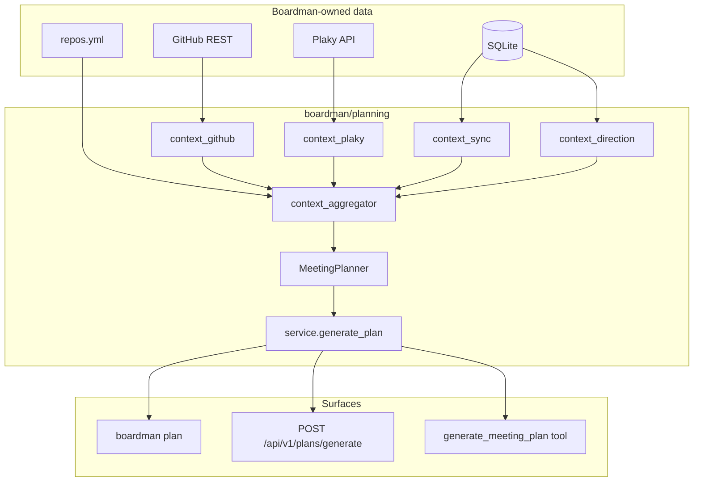

# Meeting Plans — Boardman Integration Plan

**Goal:** Make meeting-plan generation a first-class, production-valid feature of **deepiri-boardman**, with the planning engine in `boardman/planning/` fed by live Plaky + GitHub data boardman already owns.

**Status (2026-06):** ~60% complete. Planner, context providers, CLI, and unit tests are ported from `deepiri-huddle`. Remaining work: richer boardman-native context, surfaces (API/agent), readiness, config unification, huddle deprecation.

**Repos:** `deepiri-boardman` (primary), `deepiri-huddle` (thin consumer after Wave 6)

---

## Waves overview

| Wave | Name | Tasks | Commits | Gate |
|------|------|-------|---------|------|
| 0 | Foundation | MP-1 | 1 | Public API frozen; existing tests green |
| 1 | Context enrichment | MP-2, MP-3 | 2 | New context modules + unit tests |
| 2 | Context wiring | MP-4 | 1 | Planner prompt includes all context sections |
| 3 | Service layer | MP-5 | 1 | CLI uses `generate_plan()` only |
| 4 | Surfaces | MP-6, MP-7, MP-8 | 3 | API, agent tool, readiness all work |
| 5 | Acceptance | MP-11 | 1 | Offline fixtures; CI green without live keys |
| 6 | Consolidation | MP-9, MP-10 | 2–3 | Single source of truth; huddle delegates |

**Total estimated commits: 11–12** (boardman) + **2** (huddle) = **13–14 commits** across both repos.

Aggressive batching (API + agent in one commit, readiness folded into Wave 5): **10–11 commits** total.

---

## Wave dependency order

```
Wave 0  Foundation (MP-1)
  └─► Wave 1  Context enrichment (MP-2, MP-3)  [parallel within wave]
        └─► Wave 2  Context wiring (MP-4)
              └─► Wave 3  Service layer (MP-5)
                    ├─► Wave 4a  HTTP API (MP-6)
                    ├─► Wave 4b  Agent tool (MP-7)
                    └─► Wave 4c  Readiness (MP-8)     [parallel within wave]
                          └─► Wave 5  Acceptance (MP-11)
Wave 6  Consolidation (MP-9, MP-10)  [after Wave 3; MP-9 can start after Wave 0]
```

---

## Wave 0 — Foundation

**Tasks:** MP-1  
**Commits:** 1  
**Branch:** `feat/planning-wave-0-foundation`

### MP-1: Canonicalize planning module

| Item | Detail |
|------|--------|
| Files | `boardman/planning/__init__.py`, `service.py` (stub), `deepiri-huddle/README.md` |
| Commit message | `feat(planning): canonicalize public API and service stub` |

**Steps:**

1. Add `generate_plan()` stub in `boardman/planning/service.py`.
2. Export `MeetingPlanner`, `MeetingRequest`, `MeetingPlan`, `generate_plan` from `planning/__init__.py`.
3. Note in huddle README that planning engine lives in boardman.

**Wave gate:**

- [ ] `from boardman.planning import MeetingPlanner, generate_plan` works
- [ ] `poetry run pytest tests/test_planning_*.py -q` passes

---

## Wave 1 — Context enrichment

**Tasks:** MP-2, MP-3 (independent; land as separate commits)  
**Commits:** 2  
**Branch:** `feat/planning-wave-1-context`

### MP-2: Sync context from SQLite

| Item | Detail |
|------|--------|
| Files | `boardman/planning/context_sync.py`, `tests/test_planning_context_sync.py` |
| Commit message | `feat(planning): add SQLite sync context for meeting agendas` |

**Data sources:** `PullRequestTaskLink`, `IssueTaskMap`, `OpenPRTrack`, `SyncLog`

**Wave gate:**

- [ ] Markdown section `## Boardman Sync State` with PR↔task groupings
- [ ] Empty DB → graceful message; unit test with in-memory SQLite

### MP-3: Direction context from scans

| Item | Detail |
|------|--------|
| Files | `boardman/planning/context_direction.py`, `tests/test_planning_context_direction.py` |
| Commit message | `feat(planning): add DIRECTION.md and scan context for agendas` |

**Data sources:** `ProjectContext`, `ScanRun`, `github/repo_fetch.py` (fallback)

**Wave gate:**

- [ ] Section `## Repo Direction` with per-repo excerpt (max 500 chars)
- [ ] Uses cached `ProjectContext` when &lt; 24h old

---

## Wave 2 — Context wiring

**Tasks:** MP-4  
**Commits:** 1  
**Branch:** `feat/planning-wave-2-aggregator`

### MP-4: Context aggregator

| Item | Detail |
|------|--------|
| Files | `boardman/planning/context_aggregator.py`, `planner.py`, `tests/test_planning_aggregator.py` |
| Commit message | `feat(planning): wire aggregator into MeetingPlanner prompt` |

**Section order (fixed for prompt stability):**

1. GitHub PRs → 2. Plaky items → 3. Boardman sync → 4. Repo direction

**Wave gate:**

- [ ] All four sections appear in prompt when configured
- [ ] Individual context failures logged; planner does not crash
- [ ] Existing planner tests still pass

---

## Wave 3 — Service layer

**Tasks:** MP-5  
**Commits:** 1  
**Branch:** `feat/planning-wave-3-service`

### MP-5: Planning service layer

| Item | Detail |
|------|--------|
| Files | `boardman/planning/service.py`, `boardman/cli/plan_commands.py` |
| Commit message | `refactor(planning): add generate_plan service; slim CLI to call it` |

**Wave gate:**

- [ ] `boardman plan weekly` behavior unchanged
- [ ] Service importable without Typer/Rich (ready for API/agent)

---

## Wave 4 — Surfaces

**Tasks:** MP-6, MP-7, MP-8 (parallel within wave; one commit each)  
**Commits:** 3  
**Branch:** `feat/planning-wave-4-surfaces`

### MP-6: HTTP API

| Item | Detail |
|------|--------|
| Files | `boardman/routes/plans.py`, `main.py`, `tests/test_plans_route.py` |
| Commit message | `feat(api): add POST /api/v1/plans/generate` |

**Endpoint:** `POST /api/v1/plans/generate` — returns markdown + metadata; optional `write_to_disk`.

**Wave gate:**

- [ ] Route returns 200 with valid markdown (including deterministic fallback)
- [ ] OpenAPI docs at `/docs`

### MP-7: Agent tool

| Item | Detail |
|------|--------|
| Files | `boardman/agent/tools/planning_tools.py`, `agent/tools/__init__.py`, `agent/prompts.py` |
| Commit message | `feat(agent): add generate_meeting_plan tool` |

**Wave gate:**

- [ ] Agent invokes tool on “generate meeting agenda” prompts
- [ ] Tool is read-only (no Plaky writes)

### MP-8: Readiness checks

| Item | Detail |
|------|--------|
| Files | `boardman/readiness.py`, `.env.example`, `docs/BOARDMAN_READINESS.md` |
| Commit message | `feat(readiness): add planning configuration checks` |

**Checks:** `PLAKY_API_KEY`, `GITHUB_PAT`, `team_*.json`, LLM provider, output dir writable.

**Wave gate:**

- [ ] `boardman readiness` shows planning section
- [ ] `--format json` includes `planning` block

---

## Wave 5 — Acceptance

**Tasks:** MP-11  
**Commits:** 1  
**Branch:** `feat/planning-wave-5-acceptance`

### MP-11: Acceptance tests and fixtures

| Item | Detail |
|------|--------|
| Files | `tests/fixtures/planning/*`, `tests/test_planning_integration.py`, `scripts/acceptance_plan.sh` |
| Commit message | `test(planning): add offline fixtures and acceptance gate` |

**Wave gate:**

- [ ] CI runs planning tests without live API keys
- [ ] Generated markdown passes `validate_meeting_plan_markdown()`
- [ ] `scripts/acceptance_plan.sh` passes in offline mode

---

## Wave 6 — Consolidation

**Tasks:** MP-9, MP-10  
**Commits:** 2–3 (boardman config + huddle deprecation; optional docs commit)  
**Branch:** `feat/planning-wave-6-consolidation`

### MP-9: Config unification

| Item | Detail |
|------|--------|
| Files | `boardman/repos_config.py`, `team_repos.py`, `team_plaky_boards.py`, `cli/plan_commands.py` (`plan doctor`) |
| Commit message | `feat(planning): derive team mappings from repos.yml with JSON fallback` |

**Wave gate:**

- [ ] `boardman plan weekly --team ai-ml` resolves repos from `repos.yml` alone
- [ ] `boardman plan doctor` prints resolved mappings
- [ ] JSON files remain override path

### MP-10: Huddle deprecation

| Item | Detail |
|------|--------|
| Boardman commit | `docs: mark boardman/planning as canonical meeting plan engine` |
| Huddle commit(s) | `refactor: delegate plan commands to boardman.planning` + `chore: remove duplicated planner modules` |

**Steps:**

1. Huddle `plan weekly|custom` calls `boardman.planning.generate_plan`.
2. Delete duplicated `planner.py`, `models.py`, `plan_output.py`, `schedule.py`, `github_feed.py`, `plaky_feed.py` from huddle.
3. Keep TUI, chat, Discord, memory in huddle only.

**Wave gate:**

- [ ] `huddle plan weekly` output schema matches `boardman plan weekly`
- [ ] No duplicated planner logic in huddle
- [ ] Huddle README documents boardman dependency

---

## Commit map (recommended)

| # | Repo | Wave | Message (short) |
|---|------|------|-----------------|
| 1 | boardman | 0 | `feat(planning): canonicalize public API and service stub` |
| 2 | boardman | 1 | `feat(planning): add SQLite sync context for meeting agendas` |
| 3 | boardman | 1 | `feat(planning): add DIRECTION.md and scan context for agendas` |
| 4 | boardman | 2 | `feat(planning): wire aggregator into MeetingPlanner prompt` |
| 5 | boardman | 3 | `refactor(planning): add generate_plan service; slim CLI` |
| 6 | boardman | 4 | `feat(api): add POST /api/v1/plans/generate` |
| 7 | boardman | 4 | `feat(agent): add generate_meeting_plan tool` |
| 8 | boardman | 4 | `feat(readiness): add planning configuration checks` |
| 9 | boardman | 5 | `test(planning): add offline fixtures and acceptance gate` |
| 10 | boardman | 6 | `feat(planning): derive team mappings from repos.yml` |
| 11 | boardman | 6 | `docs: mark planning module as canonical engine` |
| 12 | huddle | 6 | `refactor: delegate plan commands to boardman.planning` |
| 13 | huddle | 6 | `chore: remove duplicated planner modules` |

**Optional 14th commit:** `docs: update PLAN.md and README for meeting plans feature` (if not folded into commit 11).

---

## Target architecture



---

## Package layout (target)

```
boardman/planning/
├── __init__.py
├── models.py
├── planner.py
├── plan_output.py
├── schedule.py
├── llm_adapter.py
├── team_repos.py
├── team_plaky_boards.py
├── context_github.py          # existing
├── context_plaky.py           # existing
├── context_sync.py            # Wave 1
├── context_direction.py       # Wave 1
├── context_aggregator.py        # Wave 2
└── service.py                 # Wave 0 stub → Wave 3 complete
```

---

## Current state (baseline)

### Already in boardman

| Area | Location |
|------|----------|
| Planner | `boardman/planning/planner.py` |
| GitHub + Plaky context | `context_github.py`, `context_plaky.py` |
| CLI | `boardman/cli/plan_commands.py` |
| Tests | `tests/test_planning_*.py` |

### Gaps driving Waves 1–6

1. Shallow context (no SQLite sync or direction data)
2. No HTTP API or agent tool
3. No readiness gate for planning config
4. Duplicated code in huddle
5. Config split between `repos.yml` and `team_*.json`

---

## Done when (release criteria)

1. `boardman plan weekly` uses GitHub + Plaky + sync + direction context
2. `POST /api/v1/plans/generate` works and appears in OpenAPI
3. Agent can generate plans via tool
4. `boardman readiness` reports planning status
5. Huddle delegates planning to boardman; no duplicated planner code
6. Offline acceptance tests pass in CI

---

## Quick validation (per wave)

```bash
cd deepiri-boardman
poetry install --with dev

# After every wave
poetry run pytest tests/test_planning_*.py -q

# After Wave 3+
poetry run boardman plan weekly --team ai-ml --week next

# After Wave 4c
poetry run boardman readiness

# After Wave 4a
curl -s -X POST http://localhost:8090/api/v1/plans/generate \
  -H 'Content-Type: application/json' \
  -d '{"meeting_title":"Weekly","meeting_type":"weekly-status-sync","team_focus":"ai-ml","week_label":"next-week","target_date_iso":"2026-06-16","attendees_count":15,"objectives":["align priorities"]}' | jq .

# After Wave 5
bash scripts/acceptance_plan.sh
```

---

## Optional follow-ups (post Wave 6)

| ID | Feature |
|----|---------|
| MP-12 | Discord context plugin in boardman |
| MP-13 | `meeting_plans` SQLite audit table |
| MP-14 | Plan viewer in `boardman-ui` |
| MP-15 | Scheduled Sunday-night plan generation job |
| MP-16 | Extract `deepiri-planning` shared package if a third consumer appears |

---

## References

- Planning module: `boardman/planning/`
- Huddle origin: `deepiri-huddle/huddle/planner.py`
- Data models: `boardman/database/models.py`
- Repo routing: `repos.yml`, `boardman/repos_config.py`
